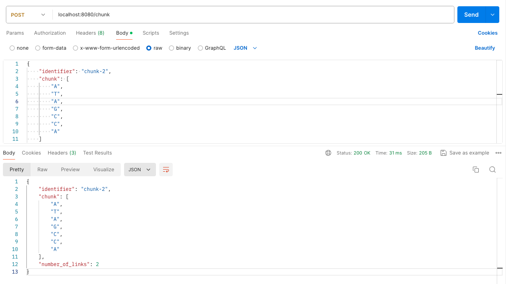

# Backend Developer Test

## Assumed hypotheses
To begin the exercise, some hypotheses have been assumed. And they are the following:
- To be a valid link it has to exist in the chunk.
- The elements of the link must be found consecutively in the chunk.
- If an element has been used for a previous link it cannot be used for another link.
- Possible links are: 
  - Between "A" and "T" or "T" and "A"
  - Between "G" and "C" or "C" and "G"

## Prerequisites
- Have a connection to postgres DB to store the result object
- Have an env file with the config of the DB, the following env vars are needed:
 ``` 
    DB_HOST=
    DB_PORT=
    DB_USER=
    DB_PASSWORD=
    DB_NAME=
```

## Solution
In order to solve this problem I have proposed that the input to the problem should be through a POST request to the API, and the body of the request should be the input mentioned in the statement in JSON format. Here am example of the request body:

```json
{
    "identifier": "chunk-1",
    "chunk": [
        "A",
        "T",
        "G",
        "C",
        "C",
        "A"
    ]
}
```

The solution shows the use of the gin-gonic framwork, used to receive the input data in the form of JSON, once parsed in the controller, the result structure is handled by an auxiliary method (corresponding to the business logic) to obtain the final result.

Once the number of links is obtained from the chunk sent in the request, the following structure is stored in the database. As primary key, the identified sent in the request, the character string that forms the chunk and the number of links obtained from the business logic.

Finally, since it is an API, it returns the object stored in the database, the complete structure. Here an example:

```json
{
    "identifier": "chunk-1",
    "chunk": [
        "A",
        "T",
        "G",
        "C",
        "C",
        "A"
    ],
    "number_of_links": 2
}
```

### How to use it
Once the application is started, this can be done with the following command:
```shell
$ go run main.go
```

Simply make a POST request to the following endopoint (assuming it is running locally):
```
localhost:8080/chunk
```

And the following body request (the same as the one in the test statement):
```json
{
    "identifier": "chunk-1",
    "chunk": [
        "A",
        "T",
        "G",
        "C",
        "C",
        "A"
    ]
}
```

Here is a complete sample of a POST call to the created API. In the image you can see both the body included in the request and the response sent by the API.



#### Bonus
As I am used to create unit tests in each controller that I make, I have added two very simple unit tests to check the functioning of the logic that is made inside the controller. For it they have been mockgen with the repository (file where the calls to the DB are made), in an automatic way with the following command.

```shell
$ mockgen -source=repository/chunk_repository.go -package=mocks > mocks/mock_chunk_repository.go
```

The first one tests that everything has gone well, and the second one mocks an error when saving the final result in the database.